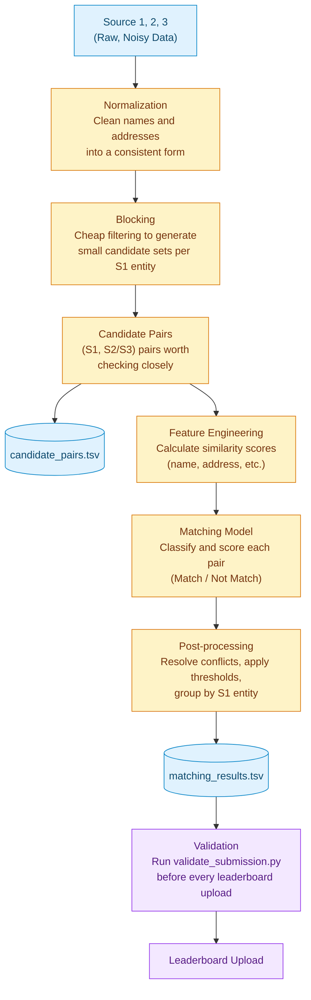

# PRD — Business Entity Resolution (Amazon ML Challenge 2026)

**Status:** Living document — filled in section by section as decisions are made.

---

## 1. Problem Framing & Goals

### 1.1 The task
Given business records from 3 independent, noisy sources, determine which Source 2 / Source 3
records refer to the same real-world business as each Source 1 (reference) entity. A Source 1
entity may have zero, one, or many true matches.

### 1.2 Optimization target
Scored on **F_0.5** (precision weighted 2× over recall), computed **per Source 1 entity** and
**macro-averaged** across all entities in the evaluation set.

Implication — our priority order, in this exact sequence:
1. **Never falsely merge two different businesses.** This is penalized hardest by F_0.5 and is
   the most damaging error in real-world entity resolution (financial/records merge that's hard
   to undo).
2. **Correctly identify singletons** (Source 1 entities with no true match). A correct empty
   prediction = 1.0 for that entity. An incorrect match on a true singleton = 0.0. This is not a
   minor edge case — it's worth full credit and must not be neglected.
3. **Recall — catch as many true matches as possible — but only without compromising #1.**

This is a deliberate design choice matching how entity resolution is scored across the industry
(fraud, KYC, healthcare record linkage) — a missed match is recoverable later; a false merge
often isn't.

### 1.3 Why this metric shape (context, not a requirement — for team alignment)
Precision-heavy metrics are standard in entity resolution because the cost of the two error
types is asymmetric: a false merge silently corrupts downstream data, while a missed match can
be caught and fixed later. This should bias every threshold/design decision downstream toward
**conservative matching on ambiguous pairs.**

<!-- ### 1.4 Definition of "done" for our team
- **Primary goal:** Top 100 finish on the leaderboard.
- **Team setup:** Working as a team (not solo) — role split to be defined (see §4).
- Top 100 is *not* just a score threshold — it also requires eligibility + submitting the
  methodology/documentation artifacts described in §3. A high score with a broken/undocumented
  package risks disqualification at the audit stage.
- Given the tight window (3 days), "done" for Day 1 specifically = a working end-to-end
  pipeline on a small sample, not a polished full-scale solution. Scale up only after the
  pipeline is proven correct. -->

---

## 2. Constraints & Requirements (from official docs — non-negotiable)

### 2.1 Disqualification / rejection risks
| Risk | Detail |
|---|---|
| External data lookups | **Strictly prohibited.** No APIs, no government business registries, no geocoding services, no internet-sourced augmentation. Pipeline must run only on provided train/test files. Immediate disqualification if found. |
| Model license/size | Final model must be **MIT or Apache 2.0 licensed** and **≤ 8B parameters**. No proprietary/closed model APIs. |
| Output format | `matching_results.tsv` must pass validation exactly (correct columns, no duplicate IDs, no IDs outside test set, no self-matches to Source 1). Failing validation = **rejected, not scored** (not even a bad score — no score). |
| Multiple team IDs | Registering/attempting via multiple IDs = instant disqualification. |
| Simultaneous logins | Only one active login per participant; violation may terminate the attempt. |

### 2.2  Logistics
- **Challenge window:** Sept 25, 12:00 AM IST → Sept 27, 11:59 PM IST.
- **Max 5 submissions/day per team**, across 3 days = **15 total leaderboard attempts**.
  Always run `validate_submission.py` locally before spending one.
- Desktop/laptop only.
- **Maintain version history of all submissions** — shortlisting is based on submitted
  solutions; source code may be requested later.

### 2.3  Required final submission package structure
```
<team_name>_submission.zip
├── output/
│   ├── matching_results.tsv      # final matches (same as leaderboard upload)
│   └── candidate_pairs.tsv       # blocking/candidate-generation output
├── code/business_entity_resolution/
│   ├── src/                      # all source code
│   ├── README.md                 # exact reproduction steps: data → blocking → matching → output
│   └── requirements.txt          # pinned dependencies
└── Documentation_template.md     # methodology write-up
```
Every team submits this zip, regardless of leaderboard rank. Top-100 packages are audited in
detail for fair-play/license compliance before final rankings are confirmed.

### 2.4  Methodology documentation must cover
- Methodology used
- Candidate generation / blocking strategy
- Model architecture and feature engineering
- Any other relevant info about the approach
- No page limit — clarity and technical depth over brevity.

### 2.5  Scoring mechanics to keep in mind
- F_0.5 per entity, **macro-averaged** — every Source 1 entity counts equally regardless of how
  many true matches it has.
- Public leaderboard = partial test set, live during challenge. Private leaderboard = remaining
  portion, revealed after. **Final ranking uses the private leaderboard** — avoid overfitting
  thresholds/decisions purely to chase the public number.

---

## 3. Data Summary (from initial exploration — Sept 25)

| File | Rows | Columns |
|---|---|---|
| train_source1.tsv | 2,206,821 | entity_id, business_name, business_address, country |
| train_source2.tsv | 5,034,616 | same |
| train_source3.tsv | 5,285,603 | same |
| train_ground_truth.tsv | 2,206,821 | source1_entity_id, matched_entity_ids |
| test_source1.tsv | 1,732,544 | same |
| test_source2.tsv | 4,887,273 | same |
| test_source3.tsv | 5,082,316 | same |

Early observations to design around:
- Some `business_address` fields are **completely empty** (e.g. `S3-859268022`) — need a
  name-only fallback path so these aren't silently unblockable.
- Source 2/3 contain **non-Latin script names** (Devanagari, for India) — raw
  Levenshtein/Jaccard on unnormalized strings will fail here.
- **Test set introduces France**, absent from training data — country must be treated as an
  open-set label; no hardcoded US/India-shaped logic (e.g. ZIP regex, US state abbreviations).

---

## 4. Team & Role Split
*(Not yet discussed — to fill in.)*

## 5. Pipeline Architecture (high-level)
A funnel: start with all possible pairs, narrow at each stage, end with a small precise set of matches.


### Iteration strategy
- **Iteration 1:** Normalize → block → 2–3 similarity features (name sim, address sim, country match) → simple threshold rule → submit. Confirms plumbing works end-to-end.
- **Iteration 2:** Use validation F_0.5 to diagnose. Low precision → tighten threshold / add features. Recall-capped → fix blocking (not the model).
- **Iteration 3+:** Once blocking and features are trusted, replace the threshold rule with a real classifier — gradient boosting (LightGBM/XGBoost) on the similarity features. Fast to train, interpretable, trivially satisfies the ≤8B/MIT-Apache constraint, and strong on tabular similarity problems like this.

## 6. Data Normalization Strategy

**Approach: script-blind, one shared normalization function for all languages/scripts (English, Hindi, Punjabi, Southern Indian languages, French).**

Rejected per-language handling (transliteration, per-language suffix dictionaries, translation) as out of scope for the timeline and unnecessary given the similarity method chosen in Feature Engineering (§8). Revisit only if post-iteration-1 validation shows a specific language/country dragging down score.

### Step 1 — Universal text cleanup (script-agnostic, applies to every record identically)
- **Unicode NFKC normalization** — collapses different Unicode representations of visually/semantically equivalent characters into one consistent form, regardless of script (Latin, Devanagari, Gurmukhi, Tamil, etc.). Fixes encoding-level noise before any comparison happens.
- Lowercase (no-op for non-Latin scripts, harmless elsewhere).
- Strip punctuation.
- Collapse extra whitespace, trim.
- Normalize digits/numbers where relevant (e.g. address house numbers).

### Step 2 — Legal suffix cleanup (Latin-script only, applied where relevant, skipped otherwise)
- Small lookup dictionary mapping common legal-suffix variants to a canonical form (e.g. `Pvt`→`Private`, `Ltd`→`Limited`, `Corp`→`Corporation`, `Inc`, `LLC`, `SARL`, `&`→`and`).
- Only meaningfully applies to English/French business names; skipped for Hindi/Punjabi/Tamil etc. — not worth building per-language suffix dictionaries given the timeline.

### Step 3 — No script detection/tagging (decision)
- Normalization stays fully script-blind — no per-row script detection or tagging in Iteration 1.
- Reason: adds complexity/debugging surface without changing matching results, since similarity scoring (§8) uses character n-grams, which don't require knowing the script.
- Revisit only if validation results (post Iteration 1) show a specific language/country underperforming — then add script tagging as a diagnostic tool, not a preemptive feature.

### Output of this stage
Each record gets a `normalized_name` and `normalized_address` field, produced by the same function regardless of source file, country, or language. These normalized fields feed directly into Blocking (§7) and Feature Engineering (§8).


## 7. Blocking / Candidate Generation Strategy

**Goal:** For each Source 1 entity, produce a small candidate list from Source 2/3 that almost certainly contains the true match (if one exists) — this stage sets the pipeline's recall ceiling. A missed candidate here can never be recovered downstream; an extra wrong candidate can still be filtered out later. So blocking should err generous, not strict.

```
The standard technique: blocking keys.

Instead of comparing every S1 record to every S2/S3 record,

you compute a cheap "key" for each record,

and only compare records that share the same key.

Records with the same key go in the same "block" — hence the name.
```

### Country handling — dynamic, not hardcoded
- Training data only has US and India; test data adds France. Country must be treated as an **open set of string labels** — never hardcoded to a fixed list (`["US","India","France"]`).
- Country grouping is done dynamically (e.g. `group_by("country")` in polars) on whatever value is actually present in the data.
- No `if country == "US"` / `elif country == "India"` branching logic anywhere in the pipeline. Any country-aware logic must be config/lookup-driven with a generic fallback for unseen country values — minimize this regardless, consistent with staying script-blind in normalization (§6).

### Blocking keys (Finalized)
1. **Country** — cheap, safe, zero recall risk (0 cross-country matches in ground truth). Dynamically partitioned.
2. **Name-keys (Pass A — Stopword & Legal Suffix Filtered)**:
   - `NF_{prefix}`: First 4 characters of the leading distinctive word (preserves primary brand identity).
   - `NS_{prefix}`: First 4 characters of the sorted distinctive words (order-invariant).
   - *Design rationale*: Filtering stopwords and normalized legal suffixes (`incorporated`, `limited`, `company`) is mandatory. Otherwise, `Prime Money Inc.` (`inco`) and `Prime Money` (`mone`) land in different blocks, and blocks for `inco` / `comp` explode to >180,000 entities (>72 billion pairs).
3. **Compound Address-keys (Pass B)**:
   - `ANW_{num}_{street_prefix}`: Normalized integer building/plot number (stripped of leading zeros) + first distinctive street word prefix (length 4). E.g., `17560_elli`, `1795_west`, `85_wayn`.
   - `ANW_{num}_{locality_prefix}`: Number + last distinctive locality/city token, ensuring invariance to component reordering (City first vs. Street first).
   - `AWP_{word1}_{word2}`: Fallback for addresses without digits (~5.7% of records), combining the first two distinctive locality tokens (e.g. `west_beng`).
   - *Design rationale*: Coarse geography alone (state/city) produces blocks of 161,431 entities in Maharashtra alone (64 billion pairs), causing immediate OOM. Coupling number + street token drops max block size in 100k records to 48 while successfully catching cross-script Indian records (where names are in Tamil/Devanagari but addresses are in Latin script).

### Strategy: multi-pass, unioned with configurable candidate cap
- Final candidate set per Source 1 entity = **union** of both passes.
- **Candidate capping**: Configurable via `.env` (`BLOCKING_MAX_CANDIDATES`, default: 150). Candidates matching on multiple keys or higher-specificity address keys are prioritized.
- **Holdout Validation Recall**: 93.53% overall (US: 97.62%, India: 87.36%) with median candidate pool of 67.
- **Output formatting**: Exported to `output/candidate_pairs.tsv` with `quote_style="never"` and `null_value=""`, ensuring singletons produce true empty fields and passing all checks in `validate_submission.py`.

### Output
This stage's candidate set (before final model narrowing) is saved as `candidate_pairs.tsv` — the exact input fed to the matching model in §8/§9.

### Implementation notes
- Use **polars** for the blocking joins (large multi-million-row joins across S1 vs S2/S3) — faster and more memory-efficient than pandas at this scale on Kaggle's available RAM.
- Blocking runs on the **normalized** name/address fields produced in §6, not raw text.


## 8. Feature Engineering & Matching Model

### 8.1 String similarity method — options considered
*(Decision finalized in §8.2 — table kept for reference/methodology doc.)*

| Method | What it does | Setup time | Speed at scale | Word-order robust | Script-agnostic |
|---|---|---|---|---|---|
| **`difflib.SequenceMatcher`** (Python built-in) | Finds longest matching character chunks between two strings, scores by coverage | None | Slow — loop-based, not vectorizable | No — sensitive to word order | Yes |
| **Trigram Jaccard** | Breaks strings into overlapping 3-character chunks, measures set overlap | Low | Fast — vectorizable (polars/numpy) | Yes | Yes |
| **TF-IDF (character n-gram) + cosine similarity** | Weights n-grams by distinctiveness (common chunks down-weighted, rare/distinctive chunks up-weighted), compares as vectors via cosine angle | Medium — needs `TfidfVectorizer(analyzer='char')` + fit/transform | Fast — vectorizable | Yes | Yes (when using `analyzer='char'`, not word-based) |

### 8.2 Decision
- **Iteration 1 (in progress):** Trigram Jaccard similarity — cheap, fast, script-agnostic, good enough to validate the end-to-end pipeline without burning setup time.
- **Iteration 2/3 (time permitting):** Upgrade to TF-IDF character n-gram + cosine similarity — smarter weighting (down-weights generic terms like "Inc"/"Ltd" that inflate similarity without being distinctive), same script-agnostic/word-order-robust properties as trigram Jaccard, for a precision boost.
- `difflib.SequenceMatcher` rejected outright — not vectorizable at this row count (millions of candidate pairs), and word-order sensitivity is a real problem given the transposition noise pattern called out in the problem statement.

### 8.3 Features computed per candidate pair
- **Name similarity** — trigram Jaccard (Iteration 1) / TF-IDF char n-gram cosine (later) on `normalized_name`. Primary signal.
- **Address similarity** — same method on `normalized_address`. Weaker alone (addresses noisier/more incomplete), strong combined with name.
- **Country match** — binary (1 if same country, 0 otherwise). Should be ~always 1 post-blocking; acts as a sanity check.
- **Length-based sanity features** (optional, cheap) — absolute difference / ratio in name length, to catch misleadingly high similarity on very short strings.
- **Output of this stage:** candidate pairs with similarity columns attached (an intermediate, in-memory table — *not* `matching_results.tsv` yet). Feeds directly into §8.4.

### 8.4 Iteration 1 — threshold rule
```
combined_score = (0.6 × name_similarity) + (0.4 × address_similarity)
match if combined_score > threshold
```
Threshold tuned on the internal validation split (§9) against `train_ground_truth.tsv`, optimizing for **F_0.5** specifically — not accuracy.

Note: an S1 entity can have multiple true matches — this is not "pick the single best candidate," it's "keep every candidate above threshold" for that entity.

**Output boundary (clarified):** this step, followed by grouping accepted pairs by `source1_entity_id`, is what actually produces `matching_results.tsv`. Feature engineering (§8.3) alone does not — it only computes the similarity scores this step consumes. Treat threshold/grouping as a separate function from similarity computation, so the threshold can be tuned without recomputing similarity every time.

### 8.5 Iteration 3+ — real classifier
Once blocking and features are trusted (via §9 validation), swap the threshold rule for **gradient boosting (LightGBM/XGBoost)** trained on the same features (name sim, address sim, country match, length features), with `train_ground_truth.tsv` providing binary match/no-match labels. Fast to train, interpretable (good for methodology doc), tiny parameter count (trivially satisfies the ≤8B/MIT-Apache constraint), strong performance on tabular similarity-feature problems.


## 9. Internal Validation Strategy

Two distinct concerns, not to be confused: **format safety** (will it be rejected?) vs. **score estimation** (how good is it, actually?). `validate_submission.py` only answers the first — it checks structural correctness, never computes or estimates F_0.5. We need our own process for the second.

### 9.1 Format safety — run before every leaderboard submission
- Run `utils/validate_submission.py` locally against `output/matching_results.tsv` (+ `output/candidate_pairs.tsv`) before every single leaderboard upload, with zero exceptions — this is free and catches the "rejected, 0 score" failure mode entirely, without costing one of our 15 daily-limited submissions.
- Pipeline output paths should exactly match the script's expected defaults: `output/matching_results.tsv`, `output/candidate_pairs.tsv`.
- `--check-ids` is optional/memory-heavy (off by default) — skip it locally if Kaggle memory is tight; a nonexistent ID only lowers score, it doesn't cause rejection, so this check is diagnostic, not a gate.
- Treat a "matched ID not in candidate_pairs.tsv" warning as a real bug signal (final matches should always be a subset of blocking candidates) — investigate, don't ignore.

### 9.2 Score estimation — internal holdout validation
Since ground truth is only available for the training set, we simulate the test scenario ourselves:
- Split `train_source1.tsv` (+ corresponding `train_ground_truth.tsv` rows) into an internal **train/validation split** — e.g. hold out a subset of Source 1 entities (with their ground truth) that our pipeline never "sees" during threshold tuning / model fitting.
- Run the full pipeline (normalize → block → features → threshold/model) on the held-out Source 1 entities as if they were test data, producing our own `matching_results.tsv`-shaped output for just that subset.
- Compute **F_0.5 per entity, macro-averaged** ourselves — exactly matching the competition's scoring formula — to get a real, trustworthy estimate of leaderboard performance before spending a submission.
- Use this number to diagnose, not just to confirm: if F_0.5 is low because of **low recall**, that's a blocking problem (§7) — go tighten/loosen blocking keys, not the model. If it's low because of **low precision**, that's a threshold/feature problem (§8) — tune the threshold or improve features.
- Re-run this holdout evaluation after every meaningful pipeline change, before deciding whether a leaderboard submission is worth spending.

### 9.3 Flagged for further discussion
- Exact holdout split size/method (random sample vs. stratified by country) — not yet finalized, revisit before implementation.

## 10. Submission & Packaging Checklist

### 10.1 Before every leaderboard submission (15 total available — 5/day × 3 days)
- [ ] Run `validate_submission.py` locally against `output/matching_results.tsv` and `output/candidate_pairs.tsv` — must print `PASS` before uploading anything.
- [ ] Confirm internal holdout F_0.5 (§9.2) improved or is at least understood vs. the last submission — don't submit blind guesses; each submission should test a specific hypothesis (new blocking key, new threshold, new feature, etc.).
- [ ] Confirm output paths match exactly: `output/matching_results.tsv`, `output/candidate_pairs.tsv`.
- [ ] Spot-check a few rows manually — especially singleton entities and France entities (test-only country) — to catch obvious pipeline bugs the validator's structural checks wouldn't catch.
- [ ] Log the submission (see §10.3 version history) before uploading.

### 10.2 Final submission package (required from every team, regardless of rank)

```
<team_name>_submission.zip
├── output/
│ ├── matching_results.tsv # final matches (same as best leaderboard upload)
│ └── candidate_pairs.tsv # blocking/candidate-generation output
├── code/business_entity_resolution/
│ ├── src/ # all source code, commented
│ ├── README.md # exact reproduction steps: data → blocking → matching → output
│ └── requirements.txt # pinned dependencies (polars, scikit-learn, lightgbm/xgboost, etc.)
└── Documentation_template.md # methodology write-up (filled in, .md or .pdf export)
```

- [ ] `output/` contains the two TSVs matching the **best/final** leaderboard submission.
- [ ] `code/business_entity_resolution/src/` is a **self-contained, runnable** copy of the pipeline — anyone should be able to regenerate both output files from train/test data using only what's in this folder.
- [ ] `README.md` gives exact run instructions, in order: data → normalization → blocking → features → model → output.
- [ ] `requirements.txt` pins exact versions (not just package names) — includes polars, scikit-learn (if TF-IDF used), lightgbm/xgboost (Iteration 3+), etc.
- [ ] `Documentation_template.md` filled in, covering: methodology used, candidate generation/blocking strategy, model architecture and feature engineering, any other relevant info. **See §10.5 — length requirement conflicts between source docs, unresolved.**
- [ ] Confirm final model is MIT/Apache 2.0 licensed and ≤8B parameters (compliance check before packaging — see §2.1).
- [ ] Confirm no external data lookups anywhere in `src/` (no APIs, no geocoding, no registries, no internet augmentation) — this gets audited.

### 10.3 Version history (required — shortlisting is based on submitted solutions)
- [ ] Maintain a running log (e.g. a simple table or git commit history) of every leaderboard submission: timestamp, what changed since last submission, internal holdout F_0.5, public leaderboard F_0.5.
- [ ] Keep code in git with meaningful commits — source code may be requested at a later stage.

### 10.4 Top-100 follow-up (if shortlisted)
- [ ] Be ready to submit, separately: methodology used, candidate generation/blocking strategy, model architecture and feature engineering, any other relevant info — this should already exist via `Documentation_template.md` if §10.2 was done properly; top-100 stage is about having it ready, not writing it from scratch under time pressure.
- [ ] Confirm each team member satisfies eligibility criteria (referenced in guidelines doc, never defined in either source doc — see §10.5).

### 10.5 Open questions / to verify (flagged, not yet resolved)
- **Documentation length conflict:** Problem statement says *"no page limit — prioritise clarity and technical depth over brevity"*; guidelines doc says *"1-2-page document"*. These contradict. Do not guess — confirm via the official query Google Form before finalizing `Documentation_template.md` length.
- **Eligibility criteria undefined:** Guidelines doc references "each team member satisfying the eligibility criteria" as a top-100 condition, but neither doc defines what this is. Confirm via Google Form — a silent miss here could disqualify the team regardless of score.
- **Leaderboard wording nuance:** Shortlisting considers both public and private leaderboard performance; final ranking among shortlisted teams uses the private leaderboard specifically. Keep this distinction clear internally so the team doesn't over-optimize for the public number alone.