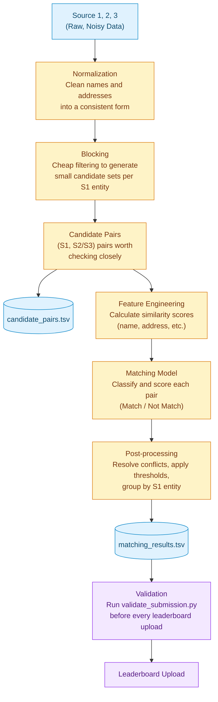

# PRD — Business Entity Resolution (Amazon ML Challenge 2026)

**Status:** Living document — filled in section by section as decisions are made.
**Last updated:** Sept 25, 11:28 PM IST (Day 0, night before challenge start)

---

## 1. Problem Framing & Goals

### 1.1 The task
Given business records from 3 independent, noisy sources, determine which Source 2 / Source 3
records refer to the same real-world business as each Source 1 (reference) entity. A Source 1
entity may have zero, one, or many true matches.

### 1.2 Optimization target
Scored on **F_0.5** (precision weighted 2× over recall), computed **per Source 1 entity** and
**macro-averaged** across all entities in the evaluation set.

Implication — our priority order, in this exact sequence:
1. **Never falsely merge two different businesses.** This is penalized hardest by F_0.5 and is
   the most damaging error in real-world entity resolution (financial/records merge that's hard
   to undo).
2. **Correctly identify singletons** (Source 1 entities with no true match). A correct empty
   prediction = 1.0 for that entity. An incorrect match on a true singleton = 0.0. This is not a
   minor edge case — it's worth full credit and must not be neglected.
3. **Recall — catch as many true matches as possible — but only without compromising #1.**

This is a deliberate design choice matching how entity resolution is scored across the industry
(fraud, KYC, healthcare record linkage) — a missed match is recoverable later; a false merge
often isn't.

### 1.3 Why this metric shape (context, not a requirement — for team alignment)
Precision-heavy metrics are standard in entity resolution because the cost of the two error
types is asymmetric: a false merge silently corrupts downstream data, while a missed match can
be caught and fixed later. This should bias every threshold/design decision downstream toward
**conservative matching on ambiguous pairs.**

<!-- ### 1.4 Definition of "done" for our team
- **Primary goal:** Top 100 finish on the leaderboard.
- **Team setup:** Working as a team (not solo) — role split to be defined (see §4).
- Top 100 is *not* just a score threshold — it also requires eligibility + submitting the
  methodology/documentation artifacts described in §3. A high score with a broken/undocumented
  package risks disqualification at the audit stage.
- Given the tight window (3 days), "done" for Day 1 specifically = a working end-to-end
  pipeline on a small sample, not a polished full-scale solution. Scale up only after the
  pipeline is proven correct. -->

---

## 2. Constraints & Requirements (from official docs — non-negotiable)

### 2.1 Disqualification / rejection risks
| Risk | Detail |
|---|---|
| External data lookups | **Strictly prohibited.** No APIs, no government business registries, no geocoding services, no internet-sourced augmentation. Pipeline must run only on provided train/test files. Immediate disqualification if found. |
| Model license/size | Final model must be **MIT or Apache 2.0 licensed** and **≤ 8B parameters**. No proprietary/closed model APIs. |
| Output format | `matching_results.tsv` must pass validation exactly (correct columns, no duplicate IDs, no IDs outside test set, no self-matches to Source 1). Failing validation = **rejected, not scored** (not even a bad score — no score). |
| Multiple team IDs | Registering/attempting via multiple IDs = instant disqualification. |
| Simultaneous logins | Only one active login per participant; violation may terminate the attempt. |

### 2.2  Logistics
- **Challenge window:** Sept 25, 12:00 AM IST → Sept 27, 11:59 PM IST.
- **Max 5 submissions/day per team**, across 3 days = **15 total leaderboard attempts**.
  Always run `validate_submission.py` locally before spending one.
- Desktop/laptop only.
- **Maintain version history of all submissions** — shortlisting is based on submitted
  solutions; source code may be requested later.

### 2.3  Required final submission package structure
```
<team_name>_submission.zip
├── output/
│   ├── matching_results.tsv      # final matches (same as leaderboard upload)
│   └── candidate_pairs.tsv       # blocking/candidate-generation output
├── code/business_entity_resolution/
│   ├── src/                      # all source code
│   ├── README.md                 # exact reproduction steps: data → blocking → matching → output
│   └── requirements.txt          # pinned dependencies
└── Documentation_template.md     # methodology write-up
```
Every team submits this zip, regardless of leaderboard rank. Top-100 packages are audited in
detail for fair-play/license compliance before final rankings are confirmed.

### 2.4  Methodology documentation must cover
- Methodology used
- Candidate generation / blocking strategy
- Model architecture and feature engineering
- Any other relevant info about the approach
- No page limit — clarity and technical depth over brevity.

### 2.5  Scoring mechanics to keep in mind
- F_0.5 per entity, **macro-averaged** — every Source 1 entity counts equally regardless of how
  many true matches it has.
- Public leaderboard = partial test set, live during challenge. Private leaderboard = remaining
  portion, revealed after. **Final ranking uses the private leaderboard** — avoid overfitting
  thresholds/decisions purely to chase the public number.

---

## 3. Data Summary (from initial exploration — Sept 25)

| File | Rows | Columns |
|---|---|---|
| train_source1.tsv | 2,206,821 | entity_id, business_name, business_address, country |
| train_source2.tsv | 5,034,616 | same |
| train_source3.tsv | 5,285,603 | same |
| train_ground_truth.tsv | 2,206,821 | source1_entity_id, matched_entity_ids |
| test_source1.tsv | 1,732,544 | same |
| test_source2.tsv | 4,887,273 | same |
| test_source3.tsv | 5,082,316 | same |

Early observations to design around:
- Some `business_address` fields are **completely empty** (e.g. `S3-859268022`) — need a
  name-only fallback path so these aren't silently unblockable.
- Source 2/3 contain **non-Latin script names** (Devanagari, for India) — raw
  Levenshtein/Jaccard on unnormalized strings will fail here.
- **Test set introduces France**, absent from training data — country must be treated as an
  open-set label; no hardcoded US/India-shaped logic (e.g. ZIP regex, US state abbreviations).

---

## 4. Team & Role Split
*(Not yet discussed — to fill in.)*

## 5. Pipeline Architecture (high-level)
A funnel: start with all possible pairs, narrow at each stage, end with a small precise set of matches.


### Iteration strategy
- **Iteration 1:** Normalize → block → 2–3 similarity features (name sim, address sim, country match) → simple threshold rule → submit. Confirms plumbing works end-to-end.
- **Iteration 2:** Use validation F_0.5 to diagnose. Low precision → tighten threshold / add features. Recall-capped → fix blocking (not the model).
- **Iteration 3+:** Once blocking and features are trusted, replace the threshold rule with a real classifier — gradient boosting (LightGBM/XGBoost) on the similarity features. Fast to train, interpretable, trivially satisfies the ≤8B/MIT-Apache constraint, and strong on tabular similarity problems like this.

## 6. Data Normalization Strategy
*(Not yet discussed — to fill in.)*

## 7. Blocking / Candidate Generation Strategy
*(Not yet discussed — to fill in.)*

## 8. Feature Engineering & Matching Model
*(Not yet discussed — to fill in.)*

## 9. Internal Validation Strategy
*(Not yet discussed — to fill in.)*

## 10. Submission & Packaging Checklist
*(Not yet discussed — to fill in.)*